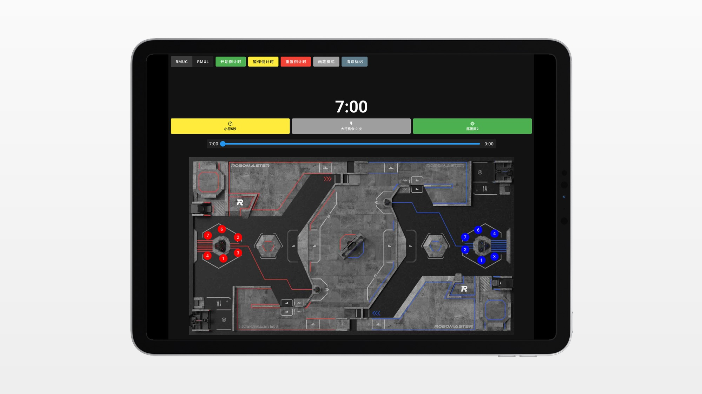

<<<<<<< HEAD
# RCIA_Tactics_Board
RM战术面板
=======
# RoboMaster 战术板

## 快速启动

初始化：npm install
启动：npm run dev

## 自动部署

项目已配置 GitHub Actions 自动构建和部署到 GitHub Pages。

### 启用 GitHub Pages

1. 进入仓库 Settings → Pages
2. 在 "Build and deployment" 部分：
   - Source: 选择 "GitHub Actions"
3. 推送到 main 分支会自动触发构建和部署

### 手动触发部署

在 Actions 页面找到 "Build and Deploy" workflow，点击 "Run workflow" 按钮。

>>>>>>> ee553a0 (init: RCIA tactics board)
